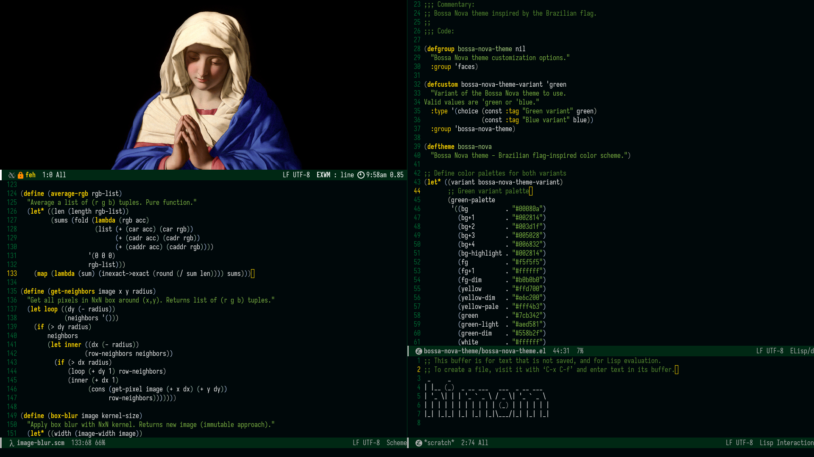
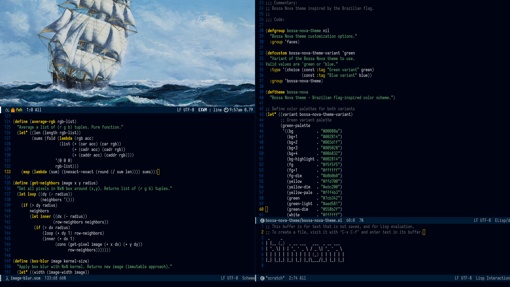

#+TITLE: Bossa Nova Theme
#+AUTHOR: 0xhenrique

A Brazilian flag-inspired Emacs theme with two variants: deep dark green and deep dark blue backgrounds, with vibrant yellow and green contrast and white text.

* Screenshots

** Green Variant

** Blue Variant

* Installation

Clone this repository and add it to your Emacs load path:

#+begin_src elisp
(add-to-list 'custom-theme-load-path "/path/to/bossa-nova-theme")
(load-theme 'bossa-nova t)
#+end_src

* Usage

** Selecting a Variant

Set the variant before loading the theme:

#+begin_src elisp
;; For green variant (default)
(setq bossa-nova-theme-variant 'green)
(load-theme 'bossa-nova t)

;; For blue variant
(setq bossa-nova-theme-variant 'blue)
(load-theme 'bossa-nova t)
#+end_src

* License

GPL-3.0-or-later
